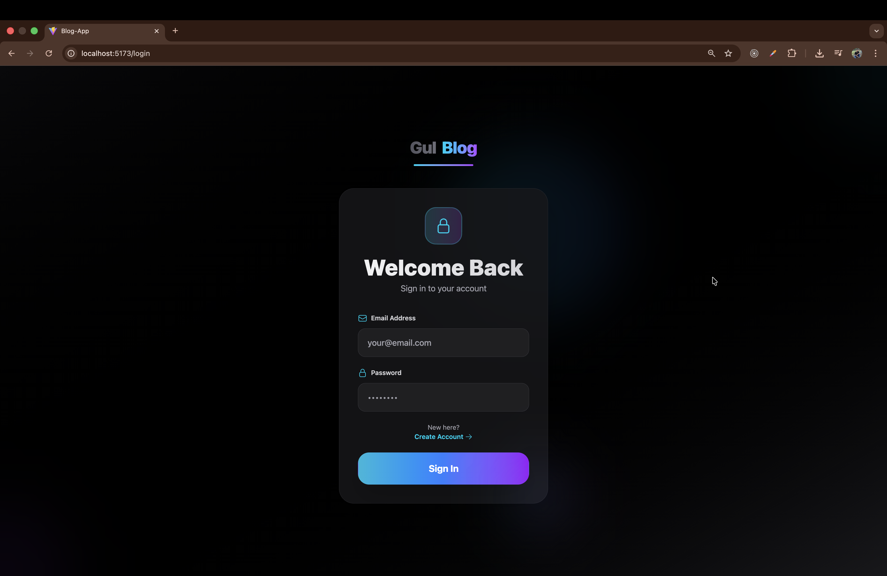
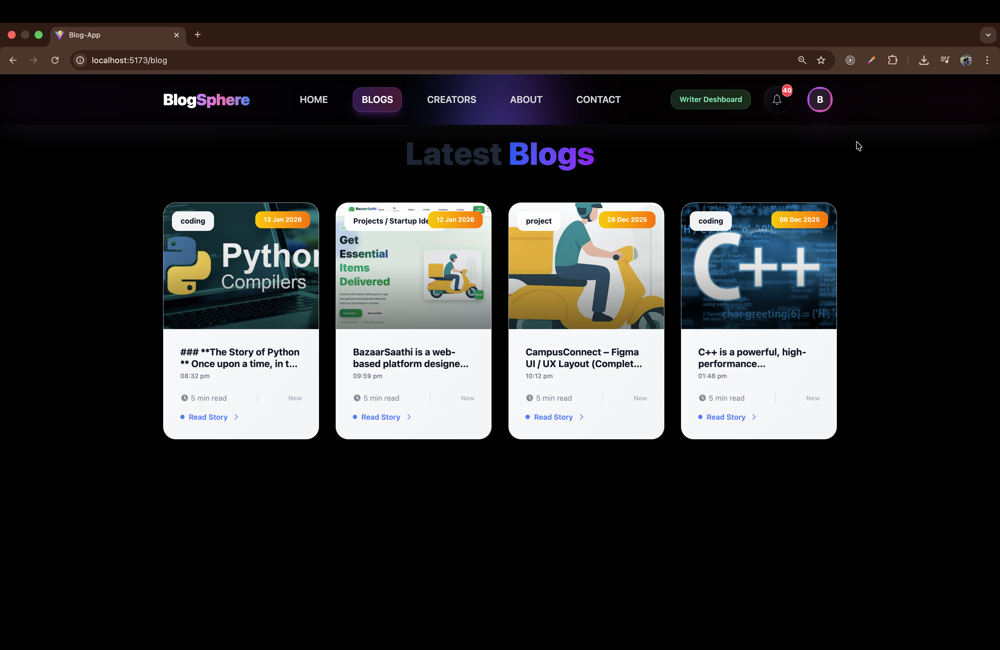
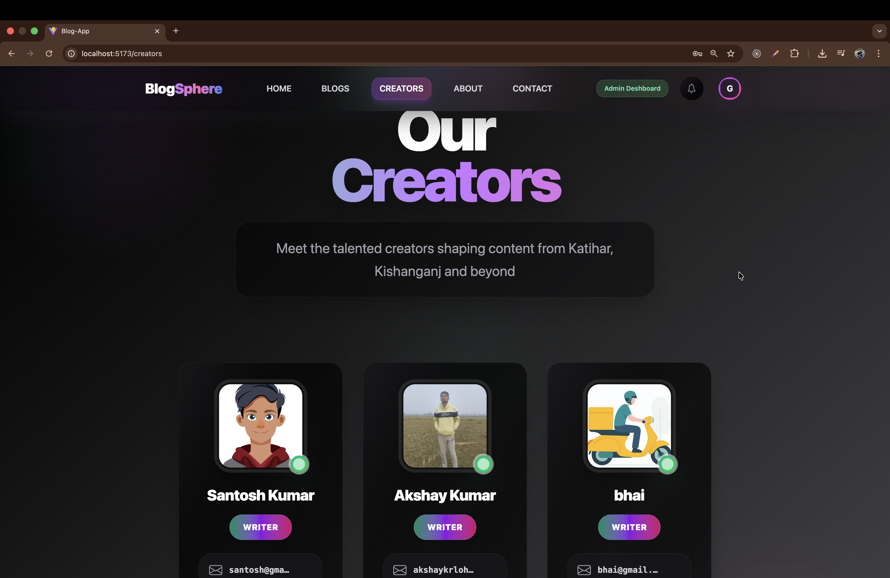
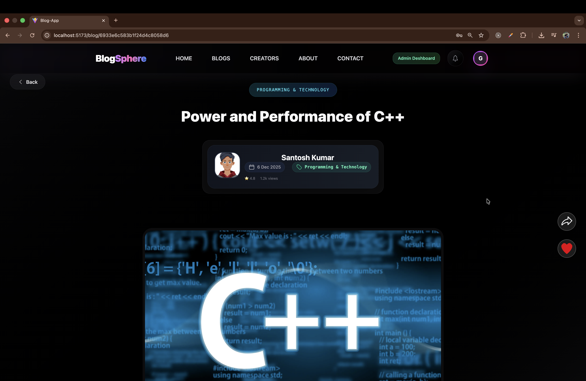
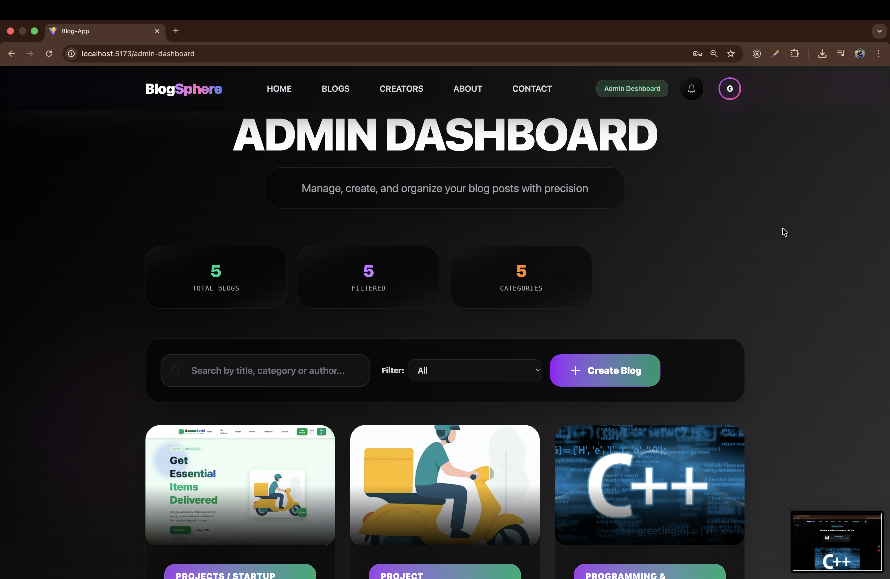
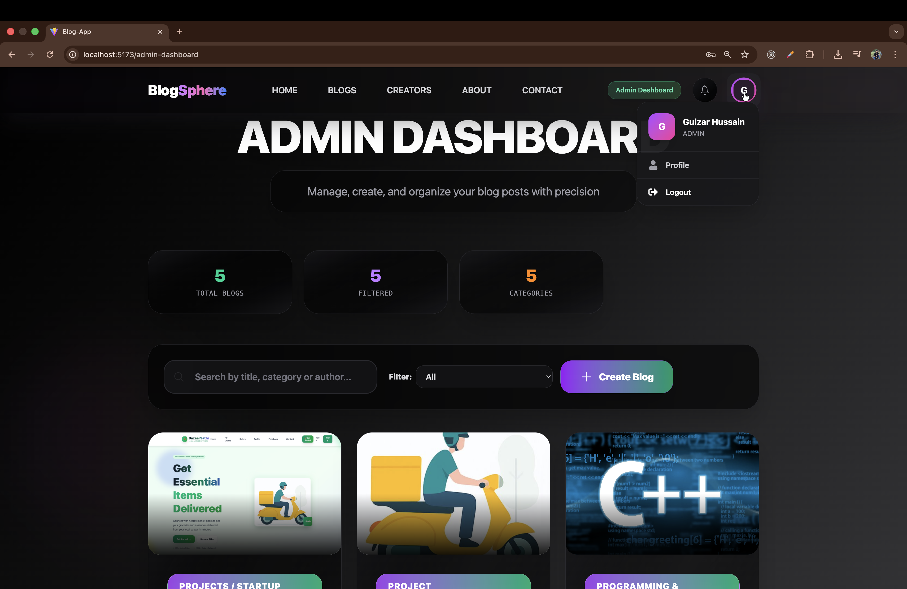

#  MERN Stack Blog Application

A full‑stack **Blog Platform** built using **MongoDB, Express, React, and Node.js** with **role‑based access control**, real‑time notifications, and a scalable architecture.

---

##  Features

###  Authentication & Authorization

* User registration & login
* JWT‑based authentication
* Role‑based access (Reader / Writer / Admin)

### 👤 Roles

**Reader**

* Read blogs
* View writer profiles
* Explore trending blogs

**Writer**

* Create, update, delete own blogs
* Manage profile
* Receive notifications

**Admin (extensible)**

* Manage users
* Moderate blogs

###  Blog System

* CRUD operations on blogs
* Category‑based blogs
* Code snippets & rich content
* Trending & creator sections

### 🔔 Real‑time Notifications

* Socket.IO based
* Blog creation & activity alerts

---

## 🛠️ Tech Stack

**Frontend**

* React.js
* Context API
* Tailwind CSS
* Framer Motion
* Socket.IO Client

**Backend**

* Node.js
* Express.js
* MongoDB & Mongoose
* JWT
* Socket.IO

---

## ▶️ Run Locally

### Backend

```bash
cd backend
npm install
npm run dev
```

### Frontend

```bash
cd frontend
npm install
npm start
```

---

##  Environment Variables

```
PORT=5000
MONGO_URI=your_mongodb_uri
JWT_SECRET=your_secret
```

---
##  Author


**Gulzar Hussain**  
MERN Stack Developer

---

##  Future Enhancements

* Blog comments & likes
* SEO optimization
* Admin dashboard
* Bookmark blogs
* Rich text editor


#  API docsumentation

Base URL: `/api`

---

##  Auth APIs

### Register User

**POST** `/users/register`

```json
{
  "name": "John",
  "email": "john@mail.com",
  "password": "123456",
  "role": "writer"
}
```

### Login User

**POST** `/users/login`

```json
{
  "email": "john@mail.com",
  "password": "123456"
}
```

---

## 👤 User APIs

### Get Profile

**GET** `/users/profile`

* Auth Required

---

##  Blog APIs

### Create Blog

**POST** `/blogs`

* Writer only

```json
{
  "title": "My Blog",
  "category": "Tech",
  "content": "Blog content"
}
```

### Get All Blogs

**GET** `/blogs`

### Get Blog By ID

**GET** `/blogs/:id`

### Update Blog

**PUT** `/blogs/:id`

* Writer (own blog)

### Delete Blog

**DELETE** `/blogs/:id`

* Writer (own blog)

---

## 🔔 Notification APIs

### Get Notifications

**GET** `/notifications`

### Mark As Read

**PUT** `/notifications/:id`

---

##  Authorization Header

```
Authorization: Bearer <JWT_TOKEN>
```

#  ER Diagram – MERN Blog Application

This ER Diagram represents the **database design** of the MERN Blog App, focusing on users, blogs, roles, and notifications.

##  ER Diagram 


---

##  Entities & Attributes

### 👤 User

```
User
----
_id (PK)
name
email (unique)
password
role (reader | writer | admin)
photo
createdAt
```

---

###  Blog

```
Blog
----
_id (PK)
title
content
category
image
user_id (FK → User._id)
createdAt
updatedAt
```

---

### 🔔 Notification

```
Notification
------------
_id (PK)
title
message
type
isRead
user_id (FK → User._id)
createdAt
```

---

##  Relationships

### User ↔ Blog

* **One User (Writer)** can create **many Blogs**
* **One Blog** belongs to **one User**

```
User (1) ──────< (M) Blog
```

---

### User ↔ Notification

* **One User** can have **many Notifications**
* **One Notification** belongs to **one User**

```
User (1) ──────< (M) Notification
```

---


## Design Decisions

* **Role stored inside User** → simple & scalable
* **Reference-based relations** using MongoDB ObjectId

---

<table>
  <tr>
    <td></td>
    <td></td>
  </tr>
  <tr>
    <td></td>
    <td></td>
  </tr>
  <tr>
    <td></td>
    <td></td>
  </tr>
  <tr>
    <td></td>
    <td></td>
  </tr>
</table>


